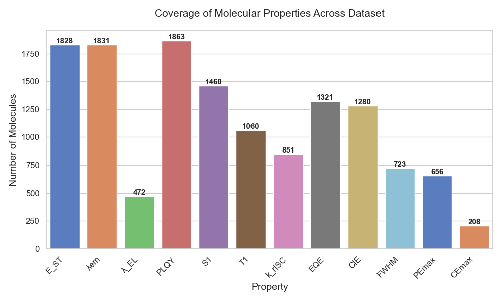
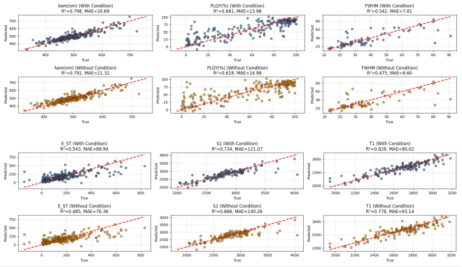

# ✨ OLED-MAMA ✨
**A multi-agent framework for automated extraction of OLED material data from scientific literature.**  
🤖 OLED-MAMA combines computer vision, OCR, and large language models to extract structured information (molecular structures, properties, tables) from PDF documents. It transforms unstructured literature into clean, machine-readable datasets ready for downstream machine learning tasks, enabling accelerated materials discovery.

[](https://www.python.org/downloads/)
[](https://opensource.org/licenses/MIT)
[](https://github.com/JaidedAI/EasyOCR)
[](https://opencv.org/)

---

## 🛠️ Environment Requirements

Main dependencies (tested versions):
- easyocr                   1.7.2
- opencv-python             4.8.0.74
- pdf2image                 1.16.3
- dashscope                 1.25.2

## 🚀 Quick Start

The entire pipeline can be launched with a single bash script:

```bash
./run_pipeline.sh <raw_pdf_dir> <yolo_weight> <yolo_project> [output_dir] [gpu_id]
```

**Example:**
```bash
./run_pipeline.sh /data/pdf_examples/ yolov5l/best.pt YOLOv5 output/pdf_extract/run_test 0
```

- `<raw_pdf_dir>` – directory containing the PDF files to process  
- `<yolo_weight>` – path to YOLOv5 weights (`best.pt`)  
- `<yolo_project>` – name of the YOLO project (used internally)  
- `[output_dir]` – optional output directory (default: `./output`)  
- `[gpu_id]` – optional GPU ID for YOLO inference

After execution, extracted table data (JSON) will be placed inside the `table_image` folder under your output directory.

---

## 🔍 Pipeline Steps
If you prefer to run each agent separately, follow the steps below. All commands assume you are in the project root. This step can further extract the molecular structure.

### Step 1: Preprocess PDFs (Figure/Table Detection)
```bash
python main_extract_oled_preprocess.py --model_pt <your_YOLO/weights/best.pt> --yolo_project_path <your_YOLO_master>  --pdf_dir </data/pdf_examples/> --output_dir [output/pdf_extract/run_tes]
```
### Step 2: Extract Tables images
```bash
python main_extract_pdf_csv_only.py  --dir2process <your_output_dir> --pdf_dir <your_raw_pdf_dir> --skip_n [skip n paper (default 0)]
```
### Step 3: Extract Tables data
```bash
python main_tongyi_extract_img2json.py  --dir2process <your_output_dir> --skip_n [skip n paper (default 0)]
```
### Step 4: OCR Text - molecules mapping
```bash
python main_extract_oled_ocr.py  --dir2process <your_output_dir> --pdf_dir <your_raw_pdf_dir> --skip_n [skip n paper (default 0)] --gpu [default 0]
```
### 🧬Molecular Structure → SMILES Conversion
Based on the results from the aforementioned four steps (i.e., the "quick start" results), use the Molecule Structure module to further convert SMILES strings. The extracted molecule name–matched image results will be placed in xxx, and the extracted molecule name–property JSON results will be stored in the table_image folder.
Run the Molecule Structure extraction script from the model—example provided below.
```bash
python run_detect_cpu_for_pdf_dirs.py --ckpt 'MolScribe/model/swin_base_char_aux_1m.pth' --dir2process your_output_dir --skip_n 0
```
You can modify the actual work of the agent according to your own needs to meet your requirements.

---

### 📁 Output Structure

A typical output directory (`/run_test/pdf-name/`) looks like:

```
molecules_detect_results_xxxxxxxxxx/
├── table_image/           # extracted tables and JSON files for them
├── cropped_images/       # cropped molecular structure images
├── detection_output/     # raw YOLO outputs
├── table-recognize/      # CSV versions of tables by direct pdf conversion
├── mol_recognize_results/  # molecule sturctures output
├── ocr_closest_to_center_fix.json         # OCR mapping output
└── extracted_images_fix/                  # OCR output
```

---
## ✏️ Downstream Machine Learning

The MLs/ folder contains six curated OLED material property datasets (TADF molecules) used in our paper. You can use these datasets directly or generate your own from extracted data.
This script (`MLs/create_dataset_mol_get_properties_xx.py`) parses the molecule‑property JSONs and compiles them into a clean CSV ready for ML models.

Raw property data from our public dataset comprises over 2,900 molecules extracted from 1,600 scientific publications.
<p align="left">
  
</p>
XGBoost Test Results on Six Typical Properties  
<p align="left">
  
</p>

---
## 📚 Citation

If you use OLED-MAMA or our results in your research, please cite our paper (to be added).

---

*Happy extracting!* 🧪🔍


